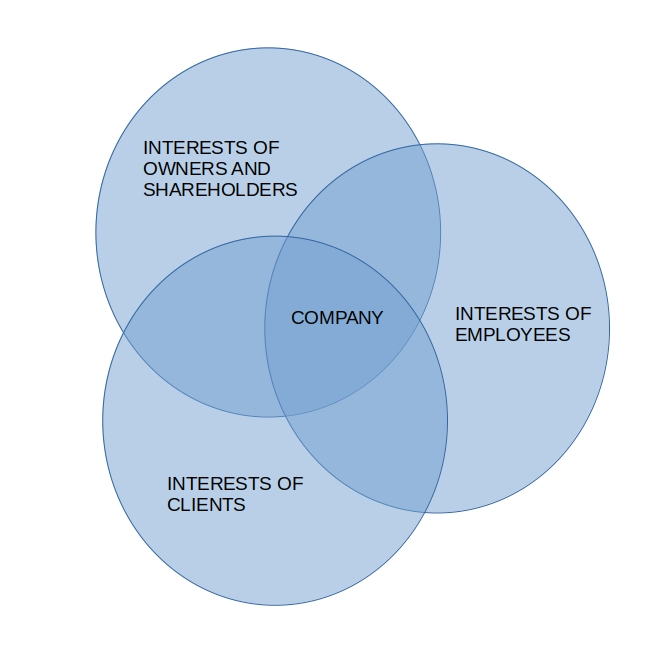

# SQL and PostgreSQL learning

A blog documenting my learning of SQL and PostgreSQL

## 2024-11-20. Database development

I'm currently monitoring my question on `dba.stackexchange.com`. I have then some free time, and I would not waste it. Let's talk about other ways I can develop this project.

In the TODOs I've mentioned two ways. First, adding new tables, and second, thinking about some basic queries. I've come to the conclusion that both are difficult without a business perspective.

I mean, until recently I looked at the project as just a database, kind of naturally. After all, it is databases I want to learn here. Now, I think the project might benefit from looking at it as a business. It shan't hurt if I learn a bit of business on the fly.

I'm a beginner in business. I thought it might be good enough to think of a company, any company, as the intersection of interests of its stakeholders. Such a model of business seems simple enough for me to comprehend, and in the same time promising enough to further the project. I've visualized how I think about it in the Venn diagram below.



The presented groups of stakeholders are only exemplificatory. One could partition stakeholders differently.

### TODOs

1. New tables adding consideration
2. PostgreSQL documentation continuation
3. Some basic queries thinking about
4. `postgresql.conf` `port` and `cluster_name` behavior
5. Project business perspective development

## 2024-11-19 (`postgresql.conf`, `port` and `cluster_name`)

I've asked about the problem at https://dba.stackexchange.com/questions/343718/why-does-old-postgresql-conf-affects-new-postgresql-version.

### TODOs

1. New tables adding consideration
2. PostgreSQL documentation continuation
3. Some basic queries thinking about
4. Further cluster and port relationship discovery
5. `postgresql.conf` `port` and `cluster_name` behavior

## 2024-11-18 (`postgresql.conf`, `port` and `cluster_name`)

First, I think it shall be good enough for my learning to just continue TODOs. While continuing, I'll be adding new ones if necessary. As soon as I'll have all the TODOs completed, I shall think what next.

Let me start with TODO 5. To remind, I was trying to correctly set the parameters `port` and `cluster_name` in `postgresql.conf`. Then I happened to notice that I had two files named `postgresql.conf` on my machine. One was from the previous PostgreSQL installation, version 12, and the other was from the current installation, version 17. I resolved to get to know how those two parameters and two files relate.

I was interested in which parameter in which file makes PostgreSQL work, and which not. To test, I used the command `psql -U postgresql -c 'select version();'`. If this command would display the proper version of PostgreSQL, that is, 17, then I would consider that the combination of parameters and files work. Otherwise I would not. The results are in the table below.

|17                      |12                      |Result
|-                       |-                       |-
|None set                |None set                |Proper version
|None set                |Only `port` set         |Proper version
|None set                |Only `cluster_name` set |Proper version
|None set                |Both set                |Proper version
|Only `port` set         |None set                |Socket error
|Only `port` set         |Only `port` set         |Cluster warning and socket error
|Only `port` set         |Only `cluster_name` set |Socket error
|Only `port` set         |Both set                |Cluster warning and socket error
|Only `cluster_name` set |None set                |Proper version
|Only `cluster_name` set |Only `port` set         |Proper version
|Only `cluster_name` set |Only `cluster_name` set |Proper version
|Only `cluster_name` set |Both set                |Proper version
|Both set                |None set                |Socket error
|Both set                |Only `port` set         |Cluster warning and socket error
|Both set                |Only `cluster_name` set |Socket error
|Both set                |Both set                |Cluster warning and socket error

"Socket error" means

```
psql: error: connection to server on socket (...) failed: No such file or directory
	Is the server running locally and accepting connections on that socket?
```

"Cluster warning" means

```
Warning: No existing cluster is suitable as a default target. Please see man pg_wrapper(1) how to specify one.
```

As you can see, there were 3 situations.

The first was that "none set" and "only `cluster_name` set" for 17 resulted in "proper version", irrelevantly what was there for 12.

The second was that "only `port` set" and "both set" for 17 resulted in "socket error" if there was either "none set" or "only `cluster_name` set" for 12.

The third was that "only `port` set" and "both set" for 17 resulted in "cluster warning and socket error" if there was either "only `port` set" or "both set" for 12.

I can understand none of the situations. I have already googled a bit, but found nothing useful. Either I searched unskillfully, or it's a rare behavior, or a thing so natural for PostgreSQL users that not worth to post too frequently about it. I'm considering asking about it on a forum or a mailing list.

### TODOs

1. New tables adding consideration
2. PostgreSQL documentation continuation
3. Some basic queries thinking about
4. Further cluster and port relationship discovery
5. `postgresql.conf` `port` and `cluster_name` behavior

## 14 Nov, 2024

I have changed the theme of the blog.

I was able to make GitHub display SQL usage statistics. That is, you can now see "SQL" usage statistics on the bar in the section "Languages" in the [repository view](https://github.com/decision-making-mike/sql-postgresql-learning). Before you could see only "HTML" and "Shell" usage statistics, they were filling the whole bar.

### TODOs

1. New tables adding consideration
2. PostgreSQL documentation continuation
3. Some basic queries thinking about
4. Further cluster and port relationship discovery
5. `postgresql.conf` `port` and `cluster_name` settings setting and unsetting no `-p` and `--cluster` `psql` invokation results matrix preparation

## 13 Nov, 2024 (summary)

Yesterday was the last day of me SQL and PostgreSQL 30 day learning. I have planned to publish a summary today, and so am I doing.

I have been learning 27 days, that is, excluding days 16, 20 and 27.

I have been blogging 24 days, that is, from day 4 to 11, and from day 15 to 30. Blogging days include days when I learned not, for I blogged I had learned not. Should I say I can work systematically, regularly? Probably not. Room for improvement.

I have red the preface and part I, and a small part of part II of the PostgreSQL documentation. Disappointing! How should I learn databases properly without theory? Need to step up me game. Of course, I have also red about various things on the net.

I have installed 2 versions of PostgreSQL, that is, 12 and 17. Would venture a guess that in most cases, at least, it is a good thing to aim for the latest stable version of an application.

I have created 1 database, 11 `create table`s and 11 `insert into`s, and 2 not so simple `select`s. I have encountered multiple errors when installing software and testing code. At least some of them was I able to handle.

I have made 70 commits to the [repository](https://github.com/decision-making-mike/sql-postgresql-learning) of this blog. As of today, there are 7 files, that is, 2 SQL scripts, 1 shell script, 2 markdown files, 1 text file and the file `.gitattributes`. The SQL scripts contain not the aforementioned 2 `select`s, these you can see on the blog (days 12 to 15, [here](https://decision-making-mike.github.io/sql-postgresql-learning/#28-oct-2024-days-12-to-15)).

What next? I think I will continue learning SQL and PostgreSQL, thus publishing on this blog. I feel I have enough to learn yet, that is, not to feel bored. But I am considering changing setting goals from "learn that many days" to "do this task".

What will I learn in particular? The PostgreSQL documentation notices in the preface, on page xxxii, that "[e]very PostgreSQL user should read [part II]", and also that "[e]veryone who runs a PostgreSQL server, be it for private use or for others, should read [part III]". Those parts wish I to read, and that reading should I then blog about.

I might also make a shift to data analysis, maybe even data science. But I yet know not how learning them could be relevant to SQL. And to analyze data I need the data. I would need to generate some (vide day 19, [here](https://decision-making-mike.github.io/sql-postgresql-learning/#01-nov-2024-day-19)).

I still can not say I know basics of PostgreSQL and SQL. And I am not sure when will I be able to say so. After reading parts II and III of the PostgreSQL documentation? After crafting 100 complex `select`s?

I wish to make me learning and knowledge more tangible, more measurable. I thus wish to focus on learning to solve any SQL problem, and to show it on this blog. Be this solving with the aid of official documentation, Stack Overflow, or what not. To do it, I should expect meself to have especial motivation. Solving problems was the thing I enjoyed the most during me learning. For example, dealing with an error. Simple input and output, we got errors, we got no errors.

I need to think about all this.

### TODOs

1. New tables adding consideration
2. PostgreSQL documentation continuation
3. Some basic queries thinking about
4. Further cluster and port relationship discovery
5. `postgresql.conf` `port` and `cluster_name` settings setting and unsetting no `-p` and `--cluster` `psql` invokation results matrix preparation

## 12 Nov, 2024 (day 30)

Interesting news when it comes to the manual port supplying problem.

First, I have found out that when PostgreSQL starts, it reads the configuration file `/etc/postgresql/<version name>/<cluster name>/postgresql.conf`.

Second, incidentally, I have found out that since the upgrade there remain on me machine some files from the previous version of PostgreSQL. Notably, said configuration file.

Third, I have learned that a PostgreSQL cluster is related to a port. Specifically, https://stackoverflow.com/a/15101962/27799074 explains that each cluster uses a different port.

I know these things may seem unrelated, but the whole thing is too much work for today. Therefore, I will today post not further, and just add a TODO.

### TODOs

1. New tables adding consideration
2. PostgreSQL documentation continuation
3. Some basic queries thinking about
4. Further cluster and port relationship discovery
5. `postgresql.conf` `port` and `cluster_name` settings setting and unsetting no `-p` and `--cluster` `psql` invokation results matrix preparation

## 11 Nov, 2024 (day 29)

I wanted to make the ERD diagram. But pgadmin refused to connect to the server, and so did psql. I decided to first deal with psql.

The first subproblem turned out to be that, for some mysterious reason, the server now listens on a different port. I found the new port in the logs and manually fed psql with it.

The second subproblem turned out to be mismatched usernames. I used `sudo -u`, and this made psql run successfully.

But wait. Was it not ugly to had to manually specify the username as well as the port when I knew psql could do without them?

It was, and so I wanted to make it prettier. I first tried to deal with usernames. I defined a user name map in `pg_ident.conf`, but `psql` still was deciding to error. Without `sudo -u`, it was erroring with `role <role name> does not exist`. With it, it was erroring with `Peer authentication failed for the user <username>`.

I replaced `sudo -u` for the option `-U` of `psql`. Then psql worked. Less one command it was, so less ugly it was, but still too complex. But I found no immediate solutions, both for the username and the port, and so I decided to focus on making pgadmin work. Luckily, it now just started to work without any further intervention. By the way, worth noting, it required providing the password for the user `postgres` for some reason, whereas psql did not.

pgadmin showed not the database `transport-company`. I know not the reason. Two comes to me mind, that is, either  the removal of PostgreSQL included removing databases, or the current version of PostgreSQL uses another directory for them. Anyway, I just recreated the database, with me script `reset-database.sh`. I had to change the script of course before so that the `psql` invokations there match the one I have now determined to work. The recreation ran without more errors than the expected `ERROR:  database "transport-company" does not exist`. I clicked "Refresh" and pgadmin started to display the new database.

The diagram looked quite nice. I knew not whether I liked the default alignment, but it was hard to align better. As for alternatives, for example https://superuser.com/a/71752/2262997 recommended Visio. But I felt not like dealing with searching, registering or downloading, setting the software up and at the end finding that it will not work with a PostgreSQL database. And I anyway wanted not to be too particular here. Possibly I, as a beginner, already get much out of the box. Let us concentrate on the big picture. After all, in case of me database I shall not be in too big a need for an ERD diagram. I can enumerate all the tables off the top of me head. That should suffice for what I have planned, that is, to write just a couple of example queries, or even add a couple of new tables.

Lastly for today, I need to correct a mistake I did when I was starting this blog. I am going to publish a summary not on 14 November, as I have written, but one day before, on 13 November. The period of 30 days started on 14 October, so it has to end on 12 November. I will publish the summary the next day after the last day.

### TODOs

1. New tables adding consideration
2. PostgreSQL documentation continuation
3. Some basic queries thinking about

## 10 Nov, 2024 (day 28)

I decided to try afresh with the upgrade of PostgreSQL.

I first removed the file `/etc/apt/sources.list.d/pg.sources`. At https://www.postgresql.org/download/ they say PostgreSQL is available for a couple of Linux distributions, but not Mint specifically. But this was not quite a problem for me as I knew Mint is based on Ubuntu. `https://www.postgresql.org/download/linux/ubuntu/` says that "[i]f the version [of PostgreSQL] included in your version of Ubuntu is not the one you want, you can use the [PostgreSQL Apt Repository](https://apt.postgresql.org/)". So, I followed the instructions available at the link given.

Now there came `apt.postgresql.org.sh`, and there came the problem of choosing the distribution name. I recall I was previously choosing names of Debian distributions. That could be the reason the upgrade had not worked. Now I checked what me `una` is based on. It was `focal`, a Ubuntu distribution. So, I guessed this name should let the installation work.

And the installation worked. I first `apt.postgresql.org.sh`ed without errors. I then `sudo apt upgrade`d without errors, or any problems with packages "kept back". I then `sudo apt install postgresql`ed without errors. I finally `pg_config --version`ed to happily see the output being `PostgreSQL 17.0 (Ubuntu 17.0-1.pgdg20.04+1)`.

Every such a problem reveals that I still know less about Linux than I would like to. And solving it teaches. I am thus glad to have it experienced and solved. To new tasks!

### TODOs

1. New tables adding consideration
2. PostgreSQL documentation continuation
3. Some basic queries thinking about
4. pgAdmin4 ERD making

## 09 Nov, 2024 (day 27)

Other activities allowed me not to do anything.

### TODOs

1. New tables adding consideration
2. PostgreSQL documentation continuation
3. Some basic queries thinking about
4. pgAdmin4 ERD making
5. PostgreSQL upgrade problem solving
6. Repository disabling and PostgreSQL reinstalling considering

## 08 Nov, 2024 (day 26)

Trial-and-erroring I was able to determine that for apt to see the upgrade for `postgresql` there is responsible a repository related to PostgreSQL. Its line is `deb [signed-by=/usr/share/postgresql-common/pgdg/apt.postgresql.org.asc] https://apt.postgresql.org/pub/repos/apt bookworm-pgdg main`. I remember not adding it. But there is a chance I have, given the same line appears at https://wiki.postgresql.org/wiki/Apt.

Anyway, there remains the question what to do with the failing update. https://askubuntu.com/questions/563178/the-following-packages-have-unmet-dependencies suggested `apt-get install -f`, so I looked up the man page, but I was seeing not clearly what should `-f` do, and anything I should expect from it I believe it did it not as the output of `apt upgrade postgresql` stayed the same.

The mentioned link suggested using aptitude. But `aptitude upgrade` seemed to have similar, if not the same, output as in the case of apt.

https://askubuntu.com/questions/140246/how-do-i-resolve-unmet-dependencies-after-adding-a-ppa suggested `apt-get dist-upgrade`, but its output was similar, if not the same, as `apt upgrade`.

For the purpose of not using the rest of the time for this project for upgrading packages, I considered it also having failed to manually install problematic dependencies. I tried `apt install postgresql-17`. It showed, among others, `Depends: postgresql-client-17 but it is not going to be installed`. `apt install postgresql-client-17` showed, among others, `Depends: libpq5 (>= 17.0) but 16.4-1.pgdg110+1 is to be installed`. `apt show -a libpq5` showed 8 versions of `libpq5`, the, I believe, newest one being `17.0-1.pgdg120+1`. `apt install libpq5=17.0-1.pgdg120+1` showed, among others, `Depends: libc6 (>= 2.33) but 2.31-0ubuntu9.16 is to be installed`. `apt install libc6=2.31-0ubuntu9.16` told me `libc6 is already the newest version (2.31-0ubuntu9.16).` Well, libc6, that is great, but you see…

What remains, not to spend too much time for? I thought I could `apt purge postgresql`, then `apt upgrade`, then `apt install postgresql`. I have not done any customizations nor configuration to me PostgreSQL, and after all this project aims at learning. After doing this, though, I realized now I both no more had the metapackage `postgresql`, and could not install it. `apt install postgresql` showed the dependency `postgresql-17` still there. I resolved to `apt remove postgresql-*` and `apt autoremove`, and `apt install postgresql`. The last command failed as before, and even `apt install postgresql-12` failed.

### TODOs

1. New tables adding consideration
2. PostgreSQL documentation continuation
3. Some basic queries thinking about
4. pgAdmin4 ERD making
5. PostgreSQL upgrade problem solving
6. Repository disabling and PostgreSQL reinstalling considering

## 07 Nov, 2024 (day 25)

Today, doing some maintenance on me system I encountered a message from apt that `The following packages have been kept back:  postgresql`. It looked odd to me insomuch I remember not to ever see such a message about "packages having been kept" before. It was appearing in the output of `apt upgrade`.

I turned to Google for more info. This message was mentioned in the context of the so-called "phased updates" in Ubuntu, in the 2022 answer of ArrayBolt3 in https://askubuntu.com/questions/1431940/what-are-phased-updates-and-why-does-ubuntu-use-them.

A reference to this message have I also found in a 2005 blog post at https://www.brain-dump.org/blog/apt-keeps-packages-back/. The author, Marc André Tanner, mentions not "phased updates", but says that "[m]aybe the package has broken or new dependencies".

Some clarity is brought by https://documentation.ubuntu.com/server/explanation/software/about-apt-upgrade-and-phased-updates/. It specifically reads that "[i]f you've ever used combinations of packages from different releases or third party repos, you may be familiar with this message already. However, it has become a much more common occurrence due to something called 'phased updates'". It goes on to say that "you don't need to do anything about the 'packages kept back' message – you can safely ignore it". But I could not as I was still unsure if it is a phased update in me case or something else.

Ubuntu said that to know more about specific packages having phased updates I can `apt policy <package-name>`. When I `apt policy postgresql`ed, I got no info about an update being phased. Let us dig deeper!

On a side note, Ubuntu notes "[t]here is a bug report currently active about the fact that the 'kept back' message is not as informative as it could be, and the issue is on our radar". I like it as I value intuitiveness of software and clarity in communication, regardless whether I regard the message itself unclear or not.

Let us try to upgrade directly the package `postgresql`. I put below the last part of the output of `apt upgrade postgresql`.

```
Some packages could not be installed. This may mean that you have
requested an impossible situation or if you are using the unstable
distribution that some required packages have not yet been created
or been moved out of Incoming.
The following information may help to resolve the situation:

The following packages have unmet dependencies:
 postgresql : Depends: postgresql-17 but it is not going to be installed
E: Broken packages
```

What I could understand from this is that the package `postgresql` could not be updated. The reason was, the update depended on having installed the package `postgresql-17`, and I had it not.

I understand that a package may depend on another package. But for me `man apt` suggests that it would automatically install dependencies. It reads under "upgrade" that "[n]ew packages will be installed if required to satisfy dependencies (…)".

OK, googling I see that to verify this suggestion seems to be a thing on its own. I would rather move forward with the actual problem. Let us simply assume that apt, for any reason, can not automatically install the dependency `postgresql-17`.

Let us see what should `apt install postgresql-17` tell us. It returns the same message as above that "[s]ome packages could not be installed". Further it says that `The following packages have unmet dependencies:`, and it shows a bunch of unmet dependencies for `postgresql-17`. Finally `E: Unable to correct problems, you have held broken packages.`. The names of most of the packages tell me nothing regarding the context of PostgreSQL. Only `postgresql-client-17` looks familiar.

I think that this is a good place to stop investigating the issue for today. Maybe tomorrow will bring us more success.

### TODOs

1. New tables adding consideration
2. PostgreSQL documentation continuation
3. Some basic queries thinking about
4. pgAdmin4 ERD making
5. PostgreSQL upgrade problem solving

## 06 Nov, 2024 (day 24)

I wanted to see an ERD from me database. So, I installed `pgAdmin3`. On connecting to the server as the user `postgres` I got

```
Error: Error connecting to the server. FATAL: Peer authentication failed for user "postgres"
```

Turned out I forgot about the map I mentioned yesterday, and that I commented it. Uncommented, tried, still getting the error. Turned out I forgot to `systemctl restart postgresql`.

After connecting, I got three errors, consecutively after pressing `OK` each time, starting with

```
Error: ERROR:  column "proisagg does not exist
LINE 9:  WHERE proisagg = FALSE AND namespace = 2200::oid
```

and then

```
ERROR:  column rel.relhasoids does not exist
LINE 1: ...t_userbyid(rel.relowner) AS relowner, rel.relacl, rel.relhas...
```
and finally yet another error I have not noted.

Then, when I looked up the tables in the "Object browser", it turned out there are not any. But the sequences was there. Moreover, when I was clicking on the "Tables" element, I was getting the above error about `rel.relhasoids`.

In https://dba.stackexchange.com/a/270930 they suggest a solution of installing a newer version of pgAdmin. It is applicable in me case as I have version 12 of PostgreSQL installed. But is there maybe a quicker method?

In https://stackoverflow.com/questions/59094036/pg-upgrade-errors there is described a similar error. It there inspired a solution of readding the server to pgAdmin. Worked not in me case.

Seemed Google has no other solutions for me. So, I decided to install a newer version of pgAdmin. https://www.pgadmin.org/download/pgadmin-4-apt/ was instructing to set up the pgAdmin APT repository to be able to download and install.

I tried names of various Debian versions for me Mint for `https://ftp.postgresql.org/pub/pgadmin/pgadmin4/apt/<name>`, and encountered several errors. I finally managed to install pgAdmin, that is, `pgAdmin4`, with the name `bullseye`.

There was an entry `pgAdmin 4` in the programs menu, but I wanted to know how to run the new version from the CLI. Typing `pgadminTAB` results in `pgadmin3`, as before the installation. That reminded me to remove `pgadmin3`, just in case Linux should decide to trouble me with problems about an incompatible version of a script, library or something. I then decided not to search for a binary now.

After running pgAdmin from the programs menu I got a "fatal error", with the message `The pgAdmin 4 server could not be contacted` followed by a dump of the "pgAdmin Runtime Environment". Maybe the errors during adding the repository and installation made the versions of some packages incompatible? Anyway, https://stackoverflow.com/a/73442717/27799074 was suggesting a solution similar to reinstalling pgAdmin, so I decided I can do just that. I know not why, but it worked, pgAdmin ran successfully. Now I see both sequences and tables.

So, back to CLI. Where is the binary? I realized I can just check it in the properties of the programs menu entry. It is `/usr/pgadmin4/bin/pgadmin4`. I preferred though `export PATH="/usr/pgadmin4/bin:$PATH"`.

### TODOs

1. New tables adding consideration
2. PostgreSQL documentation continuation
3. Some basic queries thinking about
4. pgAdmin4 ERD making

## 05 Nov, 2024 (day 23)

I have successfully logged in to the PostgreSQL server using a user name map. I needed to define the map in `pg_ident.conf`, put its name in `pg_hba.conf`, and reread `pg_ident.conf` by executing the query `select pg_reload_conf();`.

### TODOs

1. New tables adding consideration
2. PostgreSQL documentation continuation
3. Some basic queries thinking about

## 04 Nov, 2024 (day 22)

I have completed chapter 20 of the documentation.

### TODOs

1. New tables adding consideration
2. PostgreSQL documentation continuation
3. Some basic queries thinking about

## 03 Nov, 2024 (day 21)

I have red chapter 21 of the documentation, and a bit of chapter 20.

### TODOs

1. New tables adding consideration
2. PostgreSQL documentation continuation
3. Some basic queries thinking about

## 02 Nov, 2024 (day 20)

Other activities allowed me not to do anything.

### TODOs

1. New tables adding consideration
2. PostgreSQL documentation continuation
3. Some basic queries thinking about

## 01 Nov, 2024 (day 19)

I have added the DML. You can view it at https://github.com/decision-making-mike/sql-postgresql-learning/blob/main/transport-company-database/insert-data.sql.

I have changed the name of the file with the DDL from `tables-ddl.sql` to `create-tables.sql`. As you can see, it now starts with a verb. I think the name now better conveys the fact that the file is a script, that is, a set of commands that **do** something. In the same manner have I formed the name of the file with the DDL, that is, `insert-data.sql`.

The data have I handcrafted. I wanted to have something to insert now. I am thus able to perform basic queries. I think for me learning to have more of a demonstrational feel I might need to prepare more data. Should the future concur, I shall prepare a script generating random data, of arbitrary volume. In fact I would be glad to prepare such a script, if for now other reason than for the feel of automatizing me work.

### TODOs

1. New tables adding consideration
2. PostgreSQL documentation continuation
3. Some basic queries thinking about

## 31 Oct, 2024 (day 18)

I have added descriptions of tables.

I have decided that currently I will not try to implement all the dependencies of tables I have specified in the model. It seems a better option to first read the documentation a bit. I may try to implement them when I will learn how to do it. But as I know not when exactly shall it be, and if at all, I have anyway decided to archive the model. This way I need not to update both the model and the database, should I decide to make changes in the database. So, there shall be less room for a bug.

I have added a shell script to reset the database, or speaking differently, to recreate it. It first drops the database, then it creates it, then it creates the tables. I assumed it works properly just because I received no errors when executing it, and because the previous scripts for verifying the DDL returned data. You can view the script at https://github.com/decision-making-mike/sql-postgresql-learning/blob/main/transport-company-database/reset-database.sh.

Having the reset script added, visibly left is there adding a file with commands for insertion of test data. I shall add a command executing this file to the reset script then.

Yesterday and today I have also red a few pieces of information from the PostgreSQL documentation about constants.

### TODOs

1. New tables adding consideration
2. PostgreSQL documentation continuation
3. DML commands adding

## 30 Oct, 2024 (day 17)

I have added descriptions of columns.

### TODOs

1. New database model tables adding consideration
2. PostgreSQL documentation continuation
3. Model implementation continuation

## 29 Oct, 2024 (day 16)

Other activities allowed me not to do anything.

## 28 Oct, 2024 (days 12 to 15)

I decided not to post during the previous 3 days. The thing is, I have accidentally committed new DDL without checking whether it works. It was then that, first, I would push changes I was not sure they work and commit and push changes of the README, that is the blog entries, or, second, I would branch off and commit and push changes of the README onto the new branch, or, third, I would push nothing and check whether the new DDL work at first. I have chosen the third option, as the first was irresponsible, and the second seemed to be too much of a hard work with understanding again how Git branching works.

So I have checked the new DDL, and it was not easy to do, but I think now me confidence about the DDL working is good enough. I can then commit changes of the README and push both the new DDL and changes of the README onto the main branch, as usual. Of course, I need to relearn Git branching soon regardless. I only hope to have more time.

So, you can see the DDL for all the tables in the model at https://github.com/decision-making-mike/sql-postgresql-learning/blob/main/transport-company-database/tables-ddl.sql. As you can see, I have put all the DDL into one script. I think it would be too much of a hassle to maintain it in separate files especially that creation of some tables depends on the existance of other tables.

I have also changed the way of verifying the DDL. Well, the verification is now more cumbersome than before as I needed to prepare two separate `select`s. It is due to me inability to handle all what I needed in one `select`, and this is because of of me shortcomings in understanding how SQL and PostgreSQL work. I am including the `select`s below.

```sql
-- First "select"

-- Why the "select distinct" seems to work the way I
--  expect it to? Here, it feels just too easy to believe
--  that it accomplishes displaying distinct rows, that
--  is, "distinct" in the way I understand it here.
select distinct
    c.table_name "Table",
    case
        when identity_generation is not null
            then concat(c.column_name, ' (identity generation ', identity_generation, ')')
        else c.column_name
    end "Column",
    case
        when data_type = 'timestamp without time zone'
            then 'timestamp (no tz)'
        when data_type = 'character varying'
            then concat('varchar (', character_maximum_length, ')')
        else data_type
    end "Data type",
    -- In general I prefer sticking to a standard way of
    --  doing something rather than coming
    --  up with a custom way, like the one below,
    --  employed by the usage of "case". But I
    --  believe now the script does its job better.
    --  However, I am not sure whether I can treat
    --  "NO" and "NOT NULL" as equivalent here. If I
    --  could, then what should be the reason of
    --  introducing the syntax "NOT NULL" instead of
    --  a syntax more aligned with the column name,
    --  namely "IS NULLABLE" or similar? Or, why should
    --  the column name, and semantics of course, not be
    --  "NOT NULL"?
    case
        when is_nullable = 'YES'
            then 'Nullable'
        when is_nullable = 'NO'
            then 'Not nullable'
        else is_nullable
    end "Is nullable?"
from
    information_schema.columns c
    left join information_schema.key_column_usage kcu
        on c.column_name = kcu.column_name
where
    -- Could my tables be in any other schema than
    --  "public"? Can I assume this constraint will
    --  always return all the tables I have created,
    --  and only them?
    c.table_schema = 'public'
order by
    c.table_name
;

-- Second "select"

select
    pgc1.relname "Table",
    pga1.attname "Column",
    case
        when pg_constraint.contype = 'p'
            then 'PK'
        when pg_constraint.contype = 'f'
            then concat('FK (', pgc2.relname, ',', pga2.attname, ')')
        else pg_constraint.contype
    end "Constraint"
from
    pg_constraint
        cross join unnest(pg_constraint.conkey) unnest_conkey
        -- That "1 = 1" is weird, it is a bad hack for
        --  me, but the join seems to work. All in all,
        --  the ultimate goal is that I will learn
        --  through this code. It does not need to be
        --  pretty. "Cross join" does not work for a
        --  reason unknown to me.
        left join unnest(pg_constraint.confkey) unnest_confkey
            on 1 = 1
        -- Sometimes I try to make a "left join" just
        --  because I think it might work, regardless
        --  whether it makes any sense to use it. Now it
        --  apparently works. I hope I will some day
        --  understand when to use all the joins.
        left join pg_class pgc1
            on pgc1.oid = pg_constraint.conrelid
        left join pg_class pgc2
            on pgc2.oid = pg_constraint.confrelid
        join pg_attribute pga1
            on
                pg_constraint.conrelid = pga1.attrelid
                and unnest_conkey = pga1.attnum
        -- I am mot sure why there must be "left join"
        --  for this join to work properly, that is,
        --  not to hide anything other than foreign keys.
        left join pg_attribute pga2
            on
                pg_constraint.confrelid = pga2.attrelid
                and unnest_confkey = pga2.attnum
where
    -- Only table constraints
    pg_constraint.conrelid <> 0
;
```

### TODOs

1. New database model tables adding consideration
2. PostgreSQL documentation continuation
3. Model implementation continuation

## 24 Oct, 2024 (day 11)

I have been trying to verify that it actually works what I wrote in the scripts. I think I have succeeded. But, the way I have achieved it feels obscure enough for me to have a feeling that what I have done is, for some reason, redundant in normal database usage.

At any rate, I am publishing the script below. I include not the file with it in the repository because I have decided to keep it somewhere else on the disk. I think it might serve as a general reference for me future PostgreSQL usage. What follows, I want to avoid keeping two copies of the same script on disk, of course not counting any backups.

It is not complete, in the sense I know not everything about it I would like. Confer me comments therewithin.

```sql
-- For more readable displaying.
\x on

-- Why the "select distinct" seems to work the way I
--  expect it to? Here, it feels just too easy to believe
--  that it accomplishes displaying distinct rows, that
--  is, "distinct" in the way I understand it here.
select distinct
    c.table_name,
    c.column_name,
    data_type,
    character_maximum_length,
    tc.constraint_type,
    -- In general I prefer sticking to a standard way of
    --  doing something rather than coming
    --  up with a custom way, like the one below,
    --  employed by the usage of "case". But I
    --  believe now the script does its job better.
    --  However, I am not sure whether I can treat
    --  "NO" and "NOT NULL" as equivalent here. If I
    --  could, then what should be the reason of
    --  introducing the syntax "NOT NULL" instead of
    --  a syntax more aligned with the column name,
    --  namely "IS NULLABLE" or similar? Or, why should
    --  the column name, and semantics of course, not be
    --  "NOT NULL"?
    case
        when is_nullable = 'NO' then 'NOT NULL'
        else ''
    end,
    identity_generation
from
    information_schema.columns c
    -- Why seems the "left outer join" to work the way I
    --  expect it to? Why not "right outer join"?
    -- What is the relation between join order in
    --  case of three and more tables and the left
    --  and right joins?
    left outer join
        information_schema.key_column_usage kcu
        on
            c.column_name = kcu.column_name
    left outer join
        information_schema.table_constraints tc
        on
            tc.constraint_name = kcu.constraint_name
where
    -- Could my tables be in any other schema than
    --  "public"? Can I assume this constraint will
    --  always return all the tables I have created,
    --  and only them?
    c.table_schema = 'public'
order by
    c.table_name
-- Semicolon in a separete line just for consistency with
--  the formatting of the whole script.
;
```

I believe this script allows me be sure, as much as a beginner sure should feel in what he diffidently does, that me DDL works. And so, according to what I said yesterday, I am also publishing the DDL of the tables I have created so far. You can see it in the repository, [here](https://github.com/decision-making-mike/sql-postgresql-learning/tree/main/transport-company-database/tables-ddl).

Other than the DDL, I am including me general comments pertaining the database design and so on. You can see them in the file `general-comments.txt`, [here](https://github.com/decision-making-mike/sql-postgresql-learning/blob/main/transport-company-database/general-comments.txt).

### TODOs

1. New database model tables adding consideration
2. PostgreSQL documentation continuation
3. Model implementation continuation

## 23 Oct, 2024 (day 10)

I red here and there about window functions. They seem not so difficult in terms of usage in databases. It is their use cases, the business logic, that seem more difficult.

I have created separate tables for companies and the relations between companies and people. The objective was to avoid duplication of the registration number of a company when it has more than one person assigned.

I have created the people, companies and vehicles tables. But I will not present the DDL yet because I have not checked whether the tables are created properly. Even considering I saw not any errors.

As soon as all the DDL is prepared and published, I plan to archive the model. By that I mean to move the file with it to an "archive" directory within the repository and change it not anymore. I should concentrate solely on the database. I believe in such a small, learning project like this it is reasonable to stick to one source of truth. It is better not to have to update multiple places with a single change, like both the model and the database. Saves me time and mistakes.

### TODOs

1. New database model tables adding consideration
2. PostgreSQL documentation continuation
3. Proper text file table creation validation way finding
4. Model implementation continuation

## 22 Oct, 2024 (day 9)

I have red chapters 2 and 3 of the PostgreSQL documentation, partly already yesterday, after publishing the day 8 update. I have thus completed the tutorial and part I. What I specifically yet understand not are window functions.

I now plan to read part II and III. Of course, I expect not to complete them before the 30 days pass. They are too big. We will see how far I will go.

I believe reading other parts, that is IV to VII, should not be of me interest during me forseeable learning of PostgreSQL.

Beyond reading, I believe to have successfully created a database, then `pg_dumpall`ed, then `drop`ped this database, and finally restored it with `psql -f`.

I have created a table with `create table` and displayed it with `\dt`. I have inserted a row thereinto with `insert into` and displayed it with `select`.

I discovered https://wiki.postgresql.org/wiki/Don%27t_Do_This

### TODOs

1. New database model tables adding consideration
2. PostgreSQL documentation continuation

## 21 Oct, 2024 (day 8)

I have added the address that a shipment is done at.

I have added descriptions of tables.

I have removed the TODO of "order placing person, cargo handing over person and cargo receiving person companies information adding." It makes no sense as there is already information about companies of any people mentioned in the model.

I should note I base the model not on any strict rules. I mean it not to represent a strict SQL point of view, the less a strict PostgreSQL one. At least for now, while I am learning. For example, I mean the notion of nullability, employed as an attribute of columns, not to adhere stricly to any standard definition. By "can be null" I just wish to mean "can the value be not present."

### TODOs

1. New database model tables adding consideration
2. PostgreSQL tutorial continuation

## 20 Oct, 2024 (day 7)

I have figured out how to push the Git changes to GitHub through the command line. Now I can do things unavailable through the GitHub website, like amending a commit.

I have updated the model a bit. I have removed the terms "consignor" and "consignee" from the "Orders" table. First, as far as I know, they were not relevant to this model. Second, I could not figure out what I had really meant by them. Instead, I am now making use in that table of the terms "Cargo handing over person" and "Cargo receiving person". I have also added the information what person has placed the order. I have reorganized the file with the model for readability.

### TODOs

1. Database model tables columns descriptions adding
2. New database model tables adding consideration
3. Order placing person, cargo handing over person and cargo receiving person companies information adding

## 19 Oct, 2024 (day 6)

I have refined and published the database model. The database is to be used by an example transport company. You can view the model at https://github.com/decision-making-mike/sql-postgresql-learning/blob/main/transport-company-database-model.md.

 I wanted the names of the tables and columns to be as straightforward as possible. 

It is not complete yet. The thing is, in this learning project, I have decided to publish resources early, and make multiple small refinements of them later, instead of publishing them only when I consider them complete. In case of this model, I should definitely add more tables. It lacks information about employees, for example. However, overall I plan not adding too many details. I want it to be an example model. It should be complex enough to allow me to use me current skills, learn new ones, and show them. In the same time it should be simple enough so that I will not get lost in the details.

### TODOs

1. Database model tables columns descriptions adding
2. New database model tables adding consideration

## 18 Oct, 2024 (day 5)

I finished the preface, and, in a way, chapter 1.

Apart from PostgreSQL, I plan to finally visualize me database model. I am not sure yet what would be the best way to do it.

## 14 to 17 Oct, 2024 (days 1 to 4)

Lacking a job too long, I decided to go back to computer science. I am to refresh me SQL basics and learn the basics of PostgreSQL. I have allotted 30 days for this. That means that the last day shall be 13 Nov, 2024. Then, on 14 Nov, 2024, here on the blog I will summarize what I have learnt.

During the first 4 days I have mainly red the Wikipedia article about SQL and some questions on Stack Overflow about "null." I have installed PostgreSQL. I have written a [post on LinkedIn](https://www.linkedin.com/posts/activity-7252380581676601344-ymVo?utm_source=share&utm_medium=member_desktop) about the commitment. I have decided to start this blog. I have decided to start reading the [PostgreSQL documentation](https://www.postgresql.org/docs/12/index.html), the reasons being, it is the official documentation, and it contains a tutorial early on. I have prepared a simple model of a database, which I am planning to transform into a database, and it then should accompany me theoretical learning.
